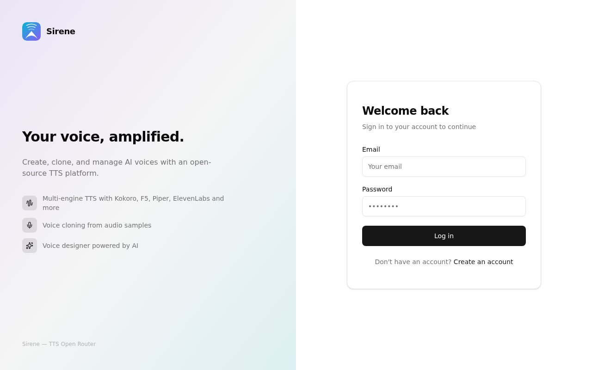
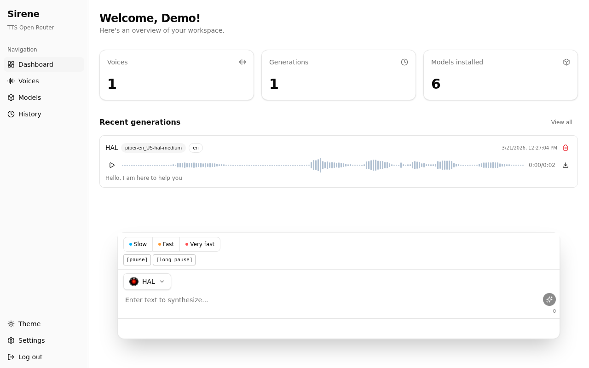
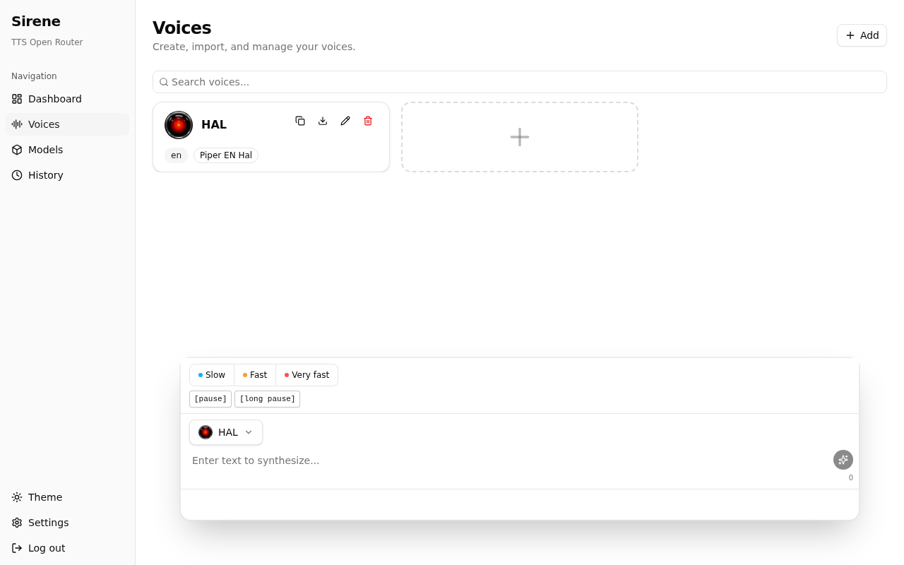
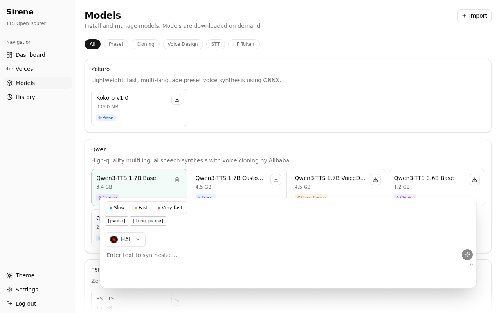
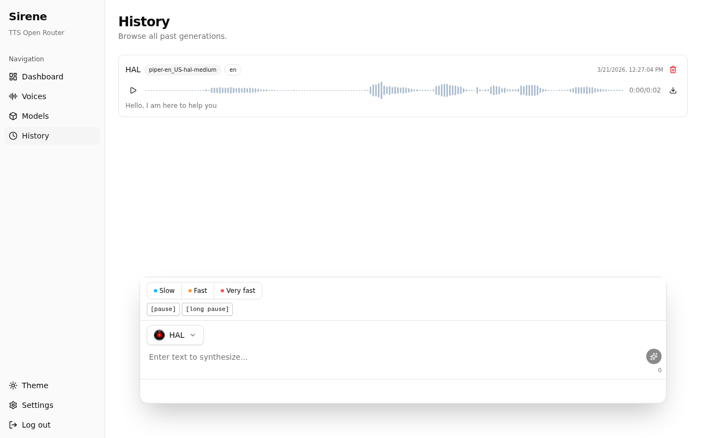

# Sirene

[](https://github.com/KevinBonnoron/sirene/actions/workflows/docker.yml)
[](https://github.com/KevinBonnoron/sirene/actions/workflows/desktop.yml)
[](https://kevinbonnoron.github.io/sirene/)

Self-hosted multi-backend text-to-speech platform with voice cloning and a modern web UI.

> **Full documentation:** [kevinbonnoron.github.io/sirene](https://kevinbonnoron.github.io/sirene/)

## Screenshots

<div align="center">
  
</div>

<br/>

<div align="center">
  
  
</div>

<div align="center">
  
  
</div>

## Quick Start

```bash
curl -sSL https://raw.githubusercontent.com/KevinBonnoron/sirene/main/install.sh | bash
```

Then open [http://localhost](http://localhost).

## Features

- **Multi-backend TTS** — Route requests to Kokoro, Qwen3-TTS, F5-TTS, Piper, CosyVoice, OpenAudio, or Chatterbox from a single interface
- **Voice cloning** — Create custom voices by uploading audio samples with zero-shot cloning
- **Model management** — Download and manage TTS models on demand from the web UI
- **Real-time updates** — Track downloads and generation progress via Server-Sent Events
- **Transcription** — Speech-to-text via Whisper models
- **Self-hosted** — Two lightweight Docker images: one for the web/API, one for inference

## Supported Backends

| Backend | Voice Cloning | Streaming | Languages |
|---------|:---:|:---:|---|
| Kokoro | — | — | EN, FR, JA, KO, ZH |
| Qwen3-TTS | Yes | — | 10+ languages |
| F5-TTS | Yes | Yes | Multilingual |
| Piper | — | — | 26 languages |
| CosyVoice | Yes | Yes | 9 languages |
| OpenAudio S1 | Yes | — | Multilingual |
| Chatterbox | Yes | — | EN + 23 languages |

## Development

### Prerequisites

- [Bun](https://bun.sh) >= 1.2.4
- [Python](https://www.python.org) >= 3.11
- [PocketBase](https://pocketbase.io) (installed automatically in the devcontainer)

### Quick Start

The easiest way is to use the **devcontainer** — open the project in VS Code or GitHub Codespaces and all dependencies are installed automatically.

For manual setup:

```bash
bun install
pip install -e "./inference[cpu]"
mkdir -p data/models
```

### Start all services

```bash
bun run dev
```

| Service | Port |
|---------|------|
| PocketBase | 8090 |
| Hono Server | 3000 |
| Vite Client | 5173 |
| Inference FastAPI | 8000 |

### Scripts

```bash
bun run dev          # All services in dev mode
bun run build        # Production build
bun run lint         # Biome lint
bun run format       # Biome format
bun run type-check   # TypeScript check
```

## License

MIT
