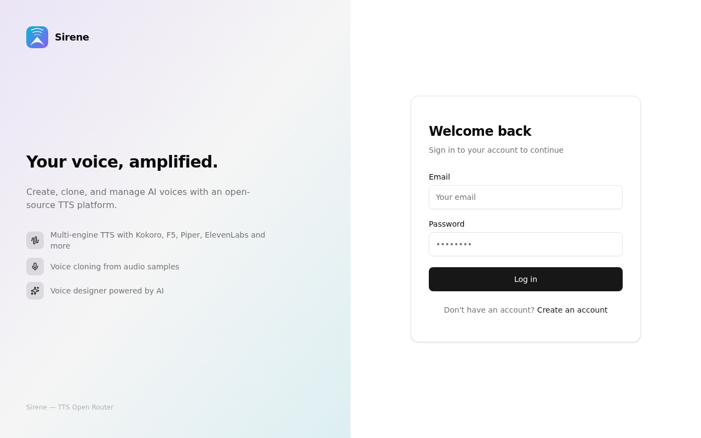
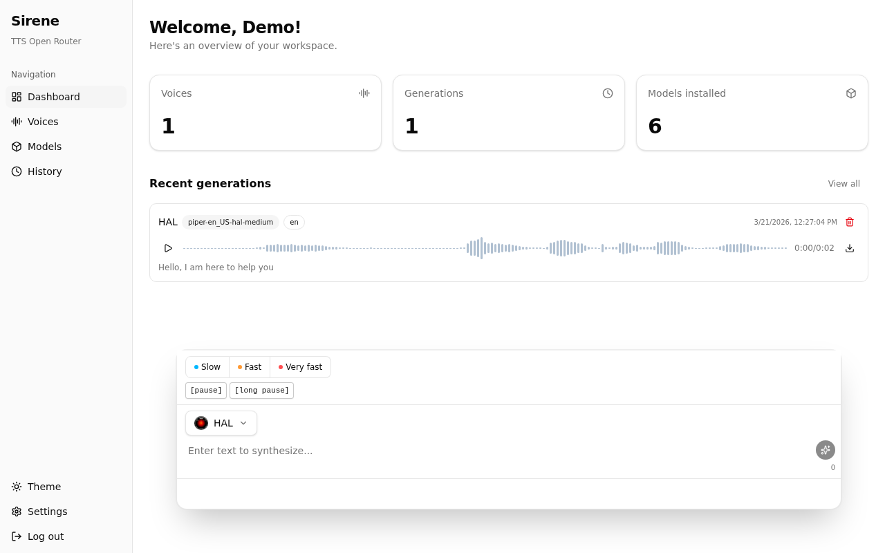
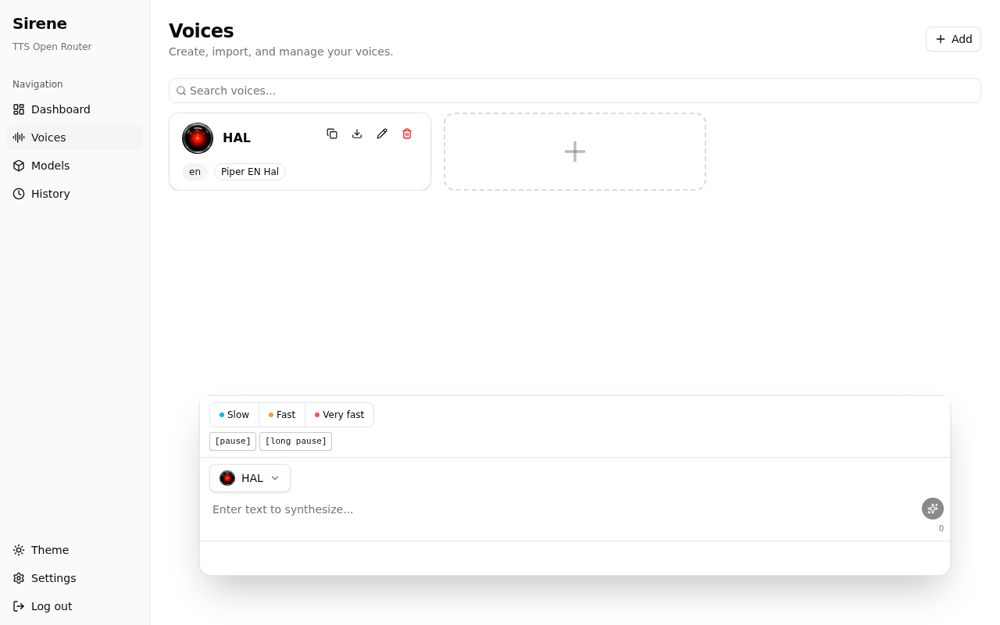
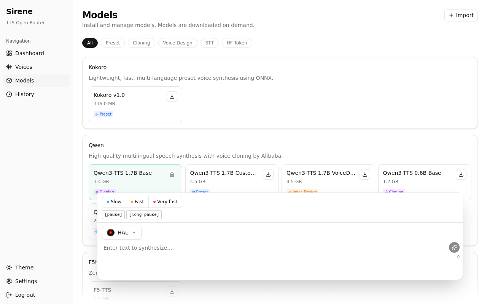
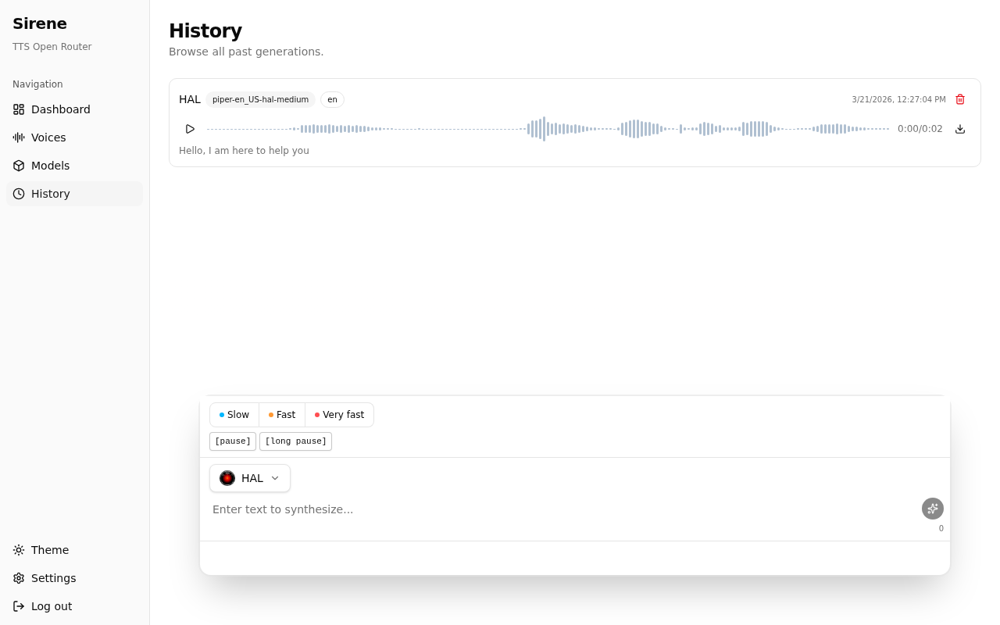

# Sirene

[](https://github.com/KevinBonnoron/sirene/actions/workflows/ci.yml)
[](https://github.com/KevinBonnoron/sirene/actions/workflows/release.yml)
[](https://kevinbonnoron.github.io/sirene/)

Self-hosted multi-backend text-to-speech platform with voice cloning and a modern web UI.

> **Full documentation:** [kevinbonnoron.github.io/sirene](https://kevinbonnoron.github.io/sirene/)

## Screenshots

<div align="center">
  
</div>

<br/>

<div align="center">
  
  
</div>

<div align="center">
  
  
</div>

## Quick Start

```bash
curl -sSL https://raw.githubusercontent.com/KevinBonnoron/sirene/main/install.sh | bash
```

Then open [http://localhost](http://localhost).

## Features

- **Multi-backend TTS** - Route requests to Kokoro, Qwen3-TTS, F5-TTS, Piper, CosyVoice, Fish Speech, or Chatterbox from a single interface
- **Voice cloning** - Create custom voices by uploading audio samples with zero-shot cloning
- **Model management** - Download and manage TTS models on demand from the web UI
- **Real-time updates** - Track downloads and generation progress via Server-Sent Events
- **Transcription** - Speech-to-text via Whisper models
- **Self-hosted** - Two Docker images: a single Go binary for the web/API/database, and one for inference

## Supported Backends

| Backend | Voice Cloning | Streaming | Languages |
|---------|:---:|:---:|---|
| Kokoro | - | - | EN, FR, JA, KO, ZH |
| Qwen3-TTS | Yes | - | 10+ languages |
| F5-TTS | Yes | - | Multilingual |
| Piper | - | - | 26 languages |
| CosyVoice | Yes | Yes | 9 languages |
| Fish Speech S2-Pro | Yes | - | 12+ languages |
| Chatterbox | Yes | - | EN + 23 languages |
| Higgs Audio V2 | Yes | - | Multilingual |
| Voxtral (Mistral) | Yes | Yes | 9 languages |

Speed and pitch are available on every backend above: those that expose no native control
are adjusted on the rendered audio by the worker. The ElevenLabs and OpenAI voices are
generated by their provider and never reach the worker, so they take speed only.

## Development

### Prerequisites

- [Task](https://taskfile.dev) (task runner)
- [Bun](https://bun.sh) >= 1.3.10
- [Go](https://go.dev) >= 1.26
- [Python](https://www.python.org) >= 3.11
- For the desktop app on Linux: GTK 3 and WebKitGTK 4.1 development headers

### Quick Start

With Nix, `direnv allow` (or `nix develop`) provides every tool. For manual setup:

```bash
task install
pip install -e "./inference[cpu]"
```

### Start all services

```bash
task dev
```

| Service | Port |
|---------|------|
| Sirene server (API + PocketBase, dashboard at /_/) | 8090 |
| Vite Client | 5173 |
| Inference FastAPI | 8000 |

### Tasks

```bash
task --list        # Every task
task dev           # Server, client and inference worker
task build         # Web UI, server binary and CLI
task build:ui      # Build the client into server/ui/dist for embedding
task test          # Go, client and inference test suites
task lint          # Biome, gofmt, go vet, ruff
task desktop:build # Wails desktop app for the host OS
task desktop:package
```

## License

MIT
